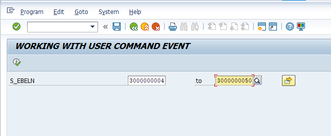
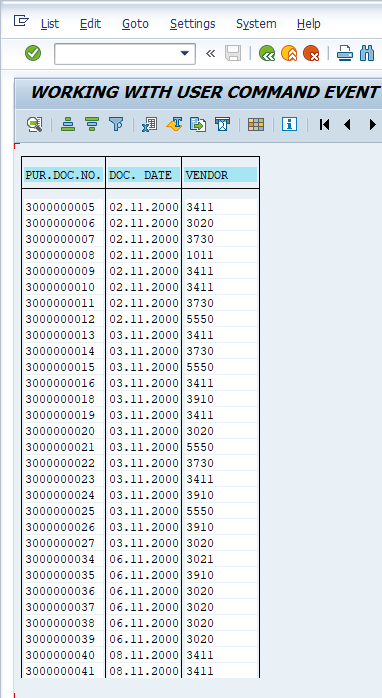
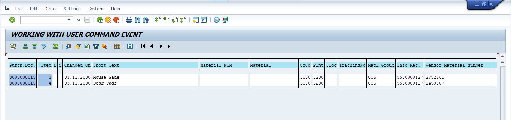
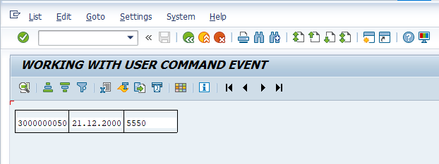

*Object : Based on the given purchase doc numbers, to display the purchase document numbers, document dates & vendor numbers by using ALV . If the user clicks on any purchasing document number only then we display the all the purchasing document item details by using ALV,if the user clicks on any vendor number only then we display the vendor details(LIFNR NAME1 ORT01).

##### Input 

##### Output: 

