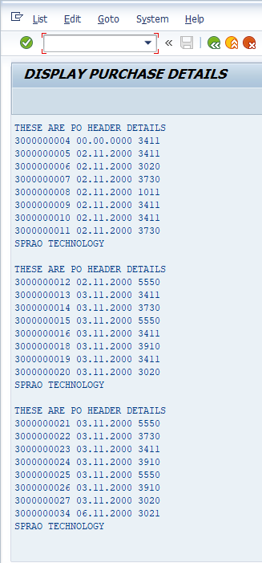

##### Problem Defination:
Based on the given purchase document number to display the purchase document numbers, document dates and vendor numbers by using classical report events,
validate the input and also provide the top of page as : these are PO header details AND end-of-page as : SPRAO Technology.

 
##### Input  

 
##### Output:  

